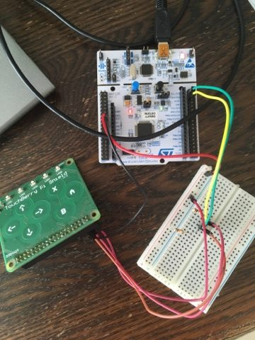

# bug-controller

## clone project
```shell
git clone git@github.com:vives-projectwerk2-2019/bug-controller.git
```
for the mbed functionality the following commands will be necessary in the work map of the project:
```shell
mbed new .
mbed deploy
```
## Requirements
1. mbed NUCLEO-L476RG
2. touchberry PI

## compile
```shell
mbed compile -m NUCLEO_L476RG -t GCC_ARM -f
```
## function
Read pushing the capacitive buttons (QT1070).
Work with i2c the read function will output an integer with which you can determine wich button was pushed. I used Putty to monitor which buttons were pressed.

Values that will be captured when certain buttons ar pressed:


## image of the setup



##LoRaWAN shield
The LoRaWAN Shield, developed at VIVES. Is an Arduino compatible board that houses an RFM95W LoRaWAN transceiver and a small EEPROM. The shield can be used on every Mbed board that has an Arduino compatible header layout.

### Pin Mapping
The LoRaWAN Shield uses some fixed pins for SPI, together with some configurable DIP switchers at the bottom to configure different mapping. This feature is available to be compatible with different microcontroller boards and other sensor shields.

Signal | Pin | configurable
--- | --- | ---
MISO | D11 | no
MISO | D12 | no
CLK | D13 | no
NSS | D0 or A0 | yes, using DIP switch
RESET | D1 or A1 | yes, using DIP switch
DIO 0 | D2 or A2 | yes, using DIP switch
DIO 1 | D3 or AR | yes, using DIP switch

#### Pins DO and D1
Some microcontroller boards like ST Nucleo have hardwired serial connections for the USB UART on the pins D0 and D1. Therefore it is impossible to combine UART communications over USB and the LoRaWAN Shield using D0 and D1. Use the DIP switches to change the configuration and use A0 and A1.

## Dependencies

### Simple LoRaWAN library

Note: This library is still in development

[https://github.com/sillevl/mbed-Simple-LoRaWAN](https://github.com/sillevl/mbed-Simple-LoRaWAN)

### LoRaWAN Serialization library

Note: This library is still in development

[https://github.com/sillevl/mbed-lorawan-serialization](https://github.com/sillevl/mbed-lorawan-serialization)
